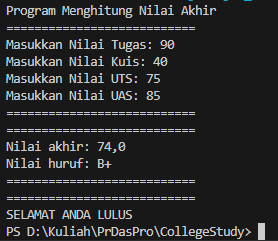
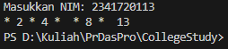
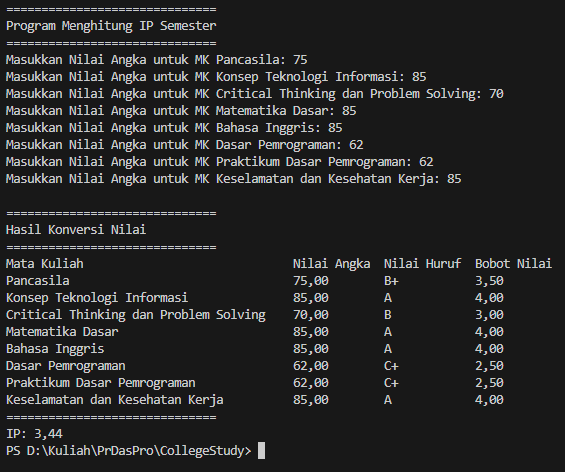
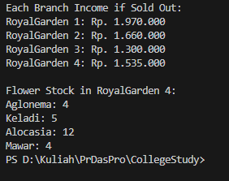
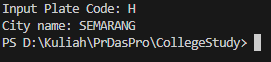
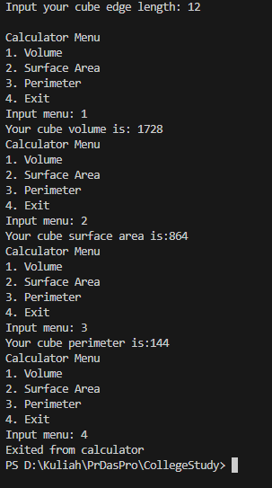

|  | Algorithm and Data Structure |
|--|--|
| NIM |  1234567|
| Nama |  You know who |
| Kelas | TI - 1I |
| Repository | [link] (https://github.com/ZidAvwa/CollegeStudy/tree/main/2ndSemester) |

# Labs #1 Programming Fundamentals Review

## 2.1.1. Selection Solution

The solution is implemented in Selection.java, and below is screenshot of the result.

**Brief explanaton:** There are 4 main step: 
1. Input all grades
2. Validate the input is every input a valid number from 0-100
3. Calculate and convert the final grade
4. Decide the final status

## 2.2.1. Looping Solution

The solution is implemented in Looping.java, and below is screenshot of the result.

**Brief explanaton:** There are 7 main step: 
1. Input NIM into the String
2. get the last 2 digit if the nim
3. start a loop from i = 1 until the length of nim
4. for every loop check the current i if i is odd then print *, if its 6 or 10 then skip, if i is even print it
5. check the last 2 digit we get from step 2 wether its less than 10 or not
6. if less than 10, add 10 into it 
7. print last two digit

## 2.3.1. Array Solution

The solution is implemented in Array.java, and below is screenshot of the result.

**Brief explanaton:** There are 6 main step: 
1. the code predefine the courses name
2. user input each course grade
3. convert each grade into letter grade ABC...
4. check the weight of the letter grades
5. using loop to print the table
6. calculate the ip and print it

## 2.4.1. Function Solution

The solution is implemented in Function.java, and below is screenshot of the result.

**Brief explanaton:** There are 4 main step: 
1. the code predefine each branches flower stock and the price of each flower type
2. calculate the total of each stock and multiply it by the corresponding prices
3. decrease the each flower stock total of 4th branch by the dedcaying flowers
4. print by calling the functions

## 3.1 Assignment 1

The solution is implemented in VehiclePlate.java, and below is screenshot of the result.

**Brief explanaton:** There are 4 main step: 
1. predefine each cities codes
2. input the code
3. check which index does the code belongs by looping through the array
4. check the city name by using the index we get
5. print each letters of the city by using a loop

## 3.2 Assignment 2

The solution is implemented in CubeCalculator.java, and below is screenshot of the result.

**Brief explanaton:** There are 4 main step: 
1. COMING SOON

