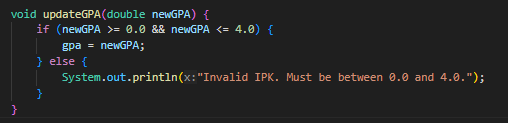
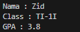
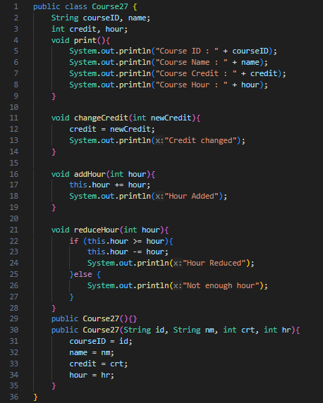
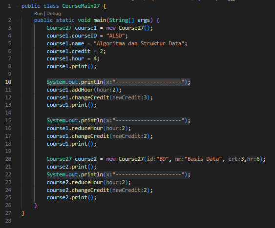
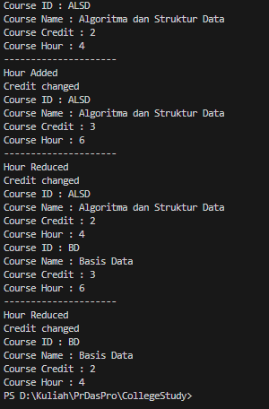
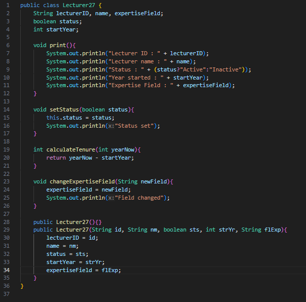
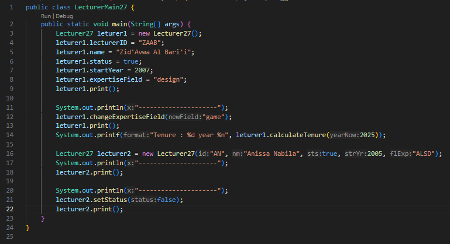
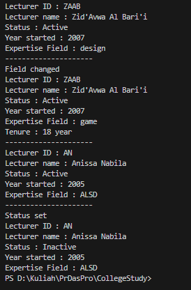

|  | Algorithm and Data Structure |
|--|--|
| NIM |  244107020083|
| Nama |  Zid'Avwa Al Bari'i |
| Kelas | TI - 1I |
| Repository | [link] (https://github.com/ZidAvwa/CollegeStudy/tree/main/2ndSemester) |

# Labs #2 Object
i answer the questions after doing the codes, my answers might differ
## 2.1. Declare Classes, Attributes and Methods

The solution is implemented in Student27.java, and below is screenshot of the result.

**Questions:**
1. thow characteristics of a class or object
    - Attributes : studentID, name, className, and gpa
    - Methods : methods define what an object can do
2.  Attributes of Student27 class:
    - studentID (String)
    - name (String)
    - className (String)
    - gpa (double)
3. Methods in the Student27 class:
    - print()
    - changeClass(String newClass)
    - updateGPA(double newGPA)
    - evaluate()
    and Constructors 
    - Student27() 
    - Student27(String id, String name, String cls, double gpa)
4. just add if like this

5. The evaluate() method determines a student's performance based on their GPA, it uses the following criteria:
    - gpa >= 3.5 → returns "Excellent"
    - gpa >= 3.0 → returns "Good"
    - gpa >= 2.0 → returns "Fair"
    - gpa < 2.0 → returns "Poor"

## 2.2. Object Instatiation and Acessing Attributes and Methods

The solution is implemented in StudentMain27.java, and below is screenshot of the result.

**Questions**
1. Student27 student1 = new Student27();
    The object name is "student1"
2. if the variables did  not declared as a static you can do an instantiation like number 1 
3. Because after the first print method, the codes in the main changes some of the data and then prints the changed data

## 2.3. Creating a Constructor

The solution is implemented in StudentMain27.java, and below is screenshot of the result.

**Questions**
1. public Student27(String id, String name, String cls, double gpa) {
    studentID = id;
    this.name = name;
    className = cls;
    this.gpa = gpa;
}
2. This line creates an instance of the Student27 class using the parameterized constructor.
3. it will not compile and show this error messages
    "The constructor Student27() is undefined"
    Java only provides a default constructor if no other constructors are defined. Since we have a parameterized constructor, Java does not automatically add a no-argument constructor, causing an error.
4. No, methods do not need to be accessed in a specific order. Each method performs a specific action and does not depend on a strict sequence. However, method execution order affects the output.
5. Student27 studentZid = new Student27("244107020083", "Zid", "TI-1I", 3.8);
    studentZid.print();

## 2.4. Assignment 1

The solution is implemented in Course27.java and CourseMain27, and below is screenshot of the result.

**Class Code**

**Main Code**

**Output**

## 2.4. Assignment 2

The solution is implemented in Lecturer27.java and LecturerMain27, and below is screenshot of the result.

**Class Code**

**Main Code**

**Output**

