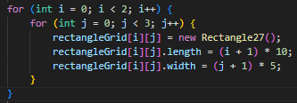
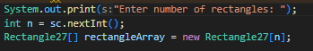
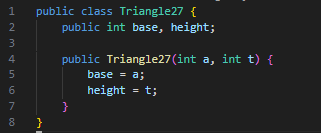
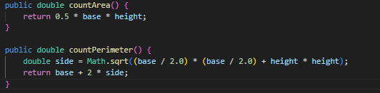
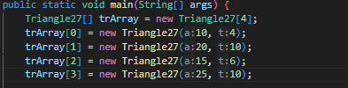
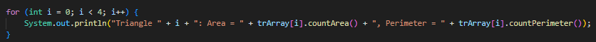
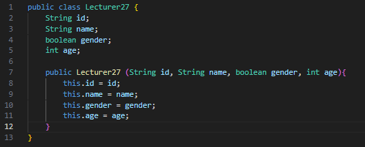
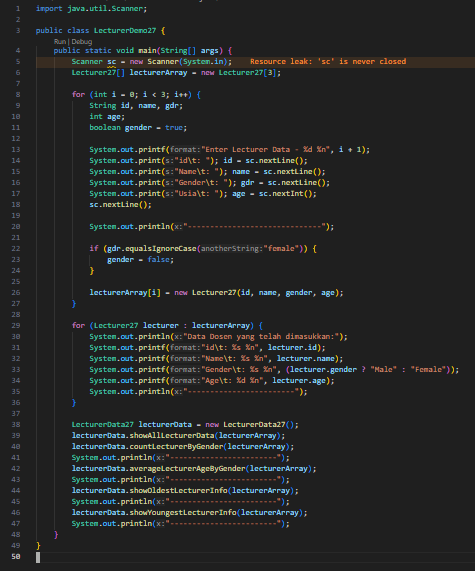
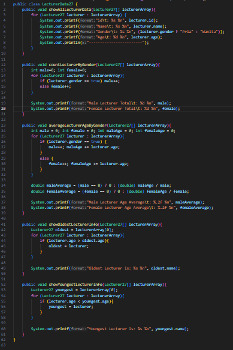
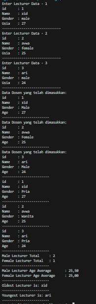

|  | Algorithm and Data Structure |
|--|--|
| NIM |  244107020083|
| Nama |  Zid'Avwa Al Bari'i |
| Kelas | TI - 1I |
| Repository | [link] (https://github.com/ZidAvwa/CollegeStudy/tree/main/2ndSemester) |

# Labs #3 Array of Object

## 1.2. Create, insert, and display Array of Object

The lab is implemented in ArrayOfObject27.java and Rectangle27.java

**Questions:**
1. No, a class doesn't need attributes or methods to be used in an array, but they help define object behavior and properties.
2. No, Rectangle27 has no constructor, but Java provides a default constructor that initializes attributes to default values.
3. It creates an array to hold three Rectangle27 object references, but the objects are not yet instantiated.
4. It creates a new Rectangle27 object at index 1 and assigns values to its length (80) and width (40).
5. Separation improves modularity, reusability, readability, and encapsulation, keeping object definition (Rectangle27) and logic (ArrayOfObjects27) distinct.

## 1.3. Input data into Array of Objects using Loops

The lab is implemented in ArrayOfObject27.java and Rectangle27.java

**Questions:**
1. Yes, an array of objects can be implemented as a 2D array. A 2D array of objects is essentially an array of arrays, where each element stores an object reference.
2. 
3. squareArray[5] is null. Declaring new Square[100] only creates an array to hold Square object references, but no objects are instantiated
4. 
5. The previous object is lost, retaining only the latest assigned object.

## 1.4. Mathematical operation in array of object’s attribute

The lab is implemented in ArrayBlocks27.java and Blocks27.java

**Questions:**
1. Yes, a class can have multiple constructors (constructor overloading) to allow different ways of object initialization.
2. 
3. 
4. 
5. 

## 1.5. Assignment

The lab is implemented in Lecturer27.java, LecturerDemo27.java and LecturerDemo27.java

**Lecturer:**

**LecturerDemo:**

**LecturerData:**

