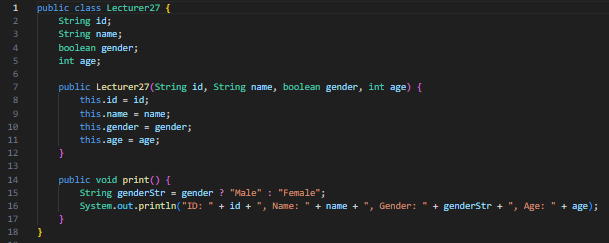
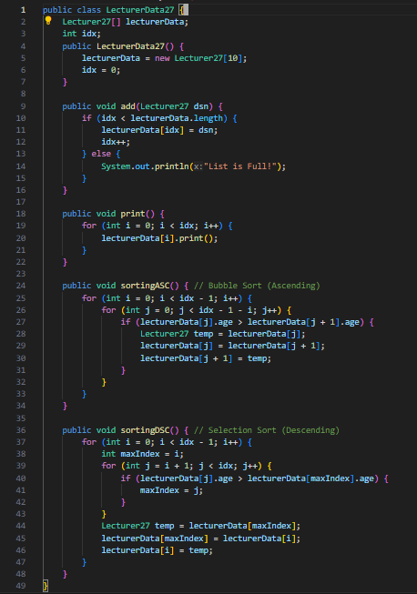
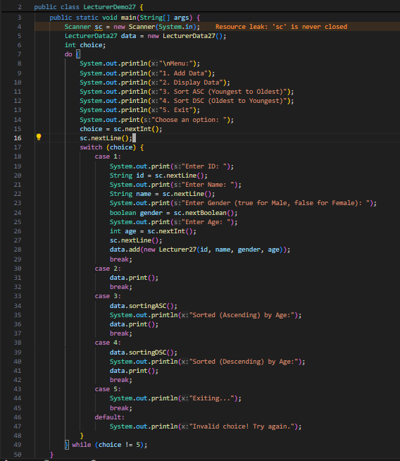

|  | Algorithm and Data Structure |
|--|--|
| NIM |  244107020083|
| Nama |  Zid'Avwa Al Bari'i |
| Kelas | TI - 1I |
| Repository | [link] (https://github.com/ZidAvwa/CollegeStudy/tree/main/2ndSemester) |

# Labs #6

## 6.2. Experiment 1 - Implementing Sorting Using Objects

The lab is implemented in Sorting27.java and MainSorting27.java

**Questions:**
1. Swaps adjacent elements if they are out of order in Bubble Sort.
2. Finds the minimum value in the unsorted part of Selection Sort:
int minIndex = i;
for (int j = i + 1; j < size; j++) {
    if (data[j] < data[minIndex]) {
        minIndex = j;
    }
}
3. Checks if shifting is needed in Insertion Sort by ensuring j is valid and data[j] > key.
4. Shifts elements right in Insertion Sort to make space for key.

## 6.3. Experiment 2 - Sorting Using an Array of Objects

The lab is implemented in Student27.java, TopStudent27.java, and StudentDemo27.java

**Questions:**
1. Bubble Sort Questions:
    a. i < idx - 1: Ensures sorting completes in idx - 1 passes.
    b. j < idx - i - 1: Avoids checking already sorted elements at the end.
    c. If listStudents has 50 elements: i runs 49 times, so 49 stages occur.
2. Modified program in SD27mod.java
6.3.9. Explanation of the Code Snippet in Selection Sort:
    - minIndex = i; → Assumes the current element (i) is the smallest.
    - Inner loop (j = i + 1 to idx) → Scans the rest of the array to find the smallest GPA.
    - if (listStudents[j].gpa < listStudents[minIndex].gpa) → Updates minIndex when a smaller GPA is found.
    - This ensures that after each iteration, the smallest element in the unsorted part is moved to its correct position.
6.3.13 change the insertion sort into descending :
public void insertionSort() {
    for (int i = 1; i < idx; i++) {
        Student27 temp = listStudents[i];
        int j = i;
        while (j > 0 && listStudents[j - 1].gpa < temp.gpa) { // Change `>` to `<` for descending order
            listStudents[j] = listStudents[j - 1];
            j--;
        }
        listStudents[j] = temp;
    }
}

## 6.4. Assignment

The Assignment is implemented in Lecturer27.java, LecturerData27.java, and LecturerDemo27.java

**Lecturer27.java :**

**LecturerData27.java :**

**LecturerDemo27.java :**

