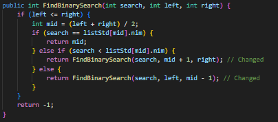
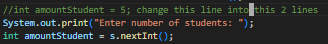
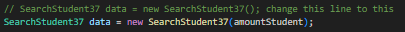
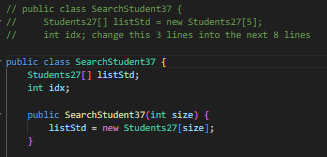
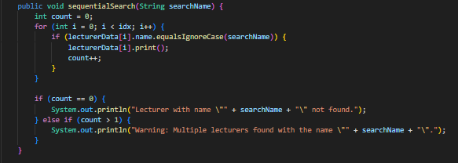
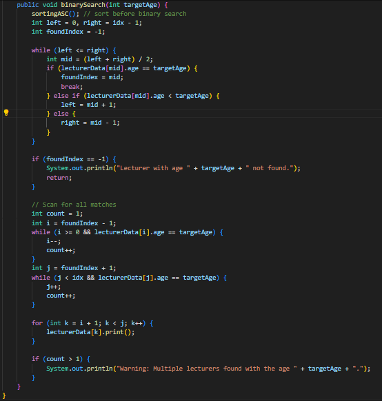
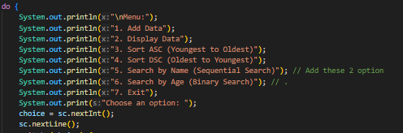
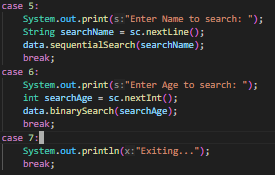

|  | Algorithm and Data Structure |
|--|--|
| NIM |  244107020083|
| Nama |  Zid'Avwa Al Bari'i |
| Kelas | TI - 1I |
| Repository | [link] (https://github.com/ZidAvwa/CollegeStudy/tree/main/2ndSemester) |

# Labs #7
## 7.2 Sequential Search Method

The lab is implemented in Students27.java, SearchStudent27.java, and MainStudent27.java

**Questions:**
1. showPosition displays whether the NIM was found and its index; showData displays the full details of the student with that NIM.
2. The break stops the loop immediately after finding the first matching NIM to avoid unnecessary checks.
3. The program won’t error if NIMs aren't sorted. The search still works because it uses sequential search, which doesn’t need sorted data.
4. position is set to -1 to indicate "not found". If no match is found, it stays -1, which the program uses to show a not-found message

## 7.3 Binary Search Method

The lab is implemented in Students27.java, SearchStudent27.java, and MainStudent27.java

**Questions:**
1. Show the program code in which runs the divide process!
    int mid = (left + right) / 2;
    Found in FindBinarySearch method – this divides the data into two halves.
    also this
    return FindBinarySearch(search, left, mid - 1); // divide left part
    return FindBinarySearch(search, mid + 1, right); // divide right part

2. Show the program code in which runs the conquer process!
    if (search == listStd[mid].nim) {
        return mid;
    } else if (search < listStd[mid].nim) {
        return FindBinarySearch(search, left, mid - 1);
    } else {
        return FindBinarySearch(search, mid + 1, right);
    }
    This part decides which half to search next.
3. No, binary search only works correctly if data is sorted in ascending order.
    If sorted from largest to smallest and you search for a number, the result will be incorrect or -1.

    
4. Change these parts

    

    

    

## 7.5. Assignment

The Assignment is implemented in Lecturer27.java, LecturerData27.java, and LecturerDemo27.java

**Changes in LecturerData27.java :**

**Changes in LecturerDemo27.java :**

