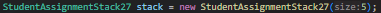
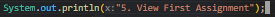
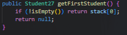
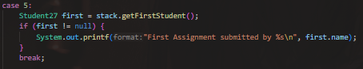
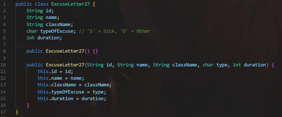
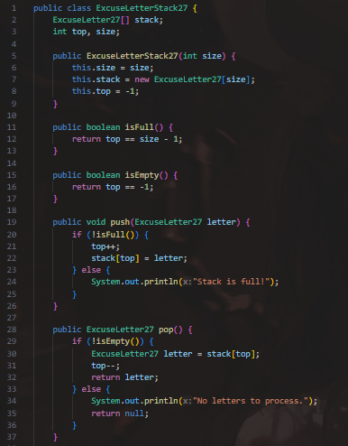
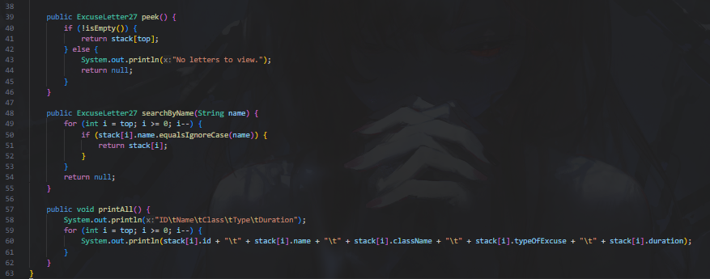
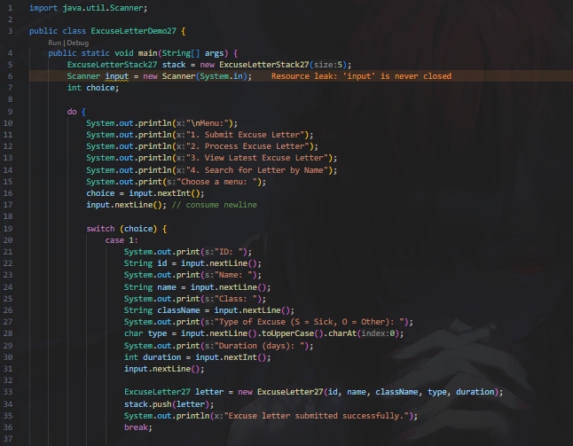
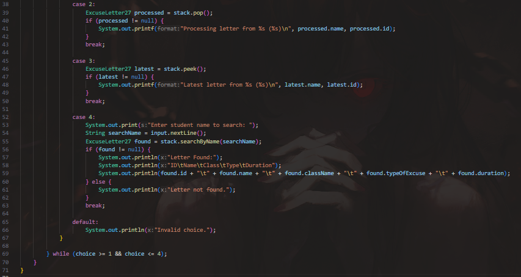

|  | Algorithm and Data Structure |
|--|--|
| NIM |  244107020083|
| Nama |  Zid'Avwa Al Bari'i |
| Kelas | TI - 1I |
| Repository | [link] (https://github.com/ZidAvwa/CollegeStudy/tree/main/2ndSemester) |

# Labs #10 STACK

## 10.1 Assignment Submission

The lab is implemented in Students27.java, StudentAssignmentStack27.java, and StudentDemo27.java

**Questions:**
1. A stack is used because it follows LIFO (Last In, First Out) behavior, matching how assignments are graded the most recent one is processed first. A queue would reverse this logic (FIFO), which isn’t suitable here.
2. **push()** adds a new student to the top of the stack, while **pop()** removes and returns the top student. In this program, push() is used when a student submits an assignment, and pop() when it's being graded.
3. Checking !isFull() before push() avoids exceeding the stack size. Without it, the program might throw an ArrayIndexOutOfBoundsException.
4. in StudentDemo27.java line 4 
5. first i add a new menu:

    

    then i add a new method in StudentAssigmentStack27.java

    

    then i call the methodon case 5 in StudentDemo27.java menu

    
6. because top is always checking the newest data we canjust
    public int countAssignments() {
        return top + 1;
    }

7. Stacks are ideal for reversing order processing (LIFO).
    Real-world example: Undo feature in text editors the last action is undone first.

## 10.2 Convert Assignment Grade to Binary

The lab is implemented in Students27.java, StudentAssignmentStack27.java, StudentDemo27.java, and ConversionStack27.java

**Questions:**
1. convertToBinary() converts an integer grade to binary using a stack:
    It repeatedly divides the grade by 2 and pushes the remainder.
    Then, it pops all remainders to build the binary string in correct order.
2. Changing the loop to while (grade != 0) has no effect because it's logically the same as grade > 0.
    But:
        If grade == 0, the loop is skipped and returns an empty string, which is incorrect.
        Solution: Handle grade == 0 case separately by returning "0".

## 10.3. Assignment

The Assignment is implemented in ExcuseLetter27.java, ExcuseLetterStack27.java, and ExcuseLetterDemo27.java

**Changes in ExcuseLetter27.java :**

**Changes in ExcuseLetterStack27.java :**

**Changes in ExcuseLetterDemo27.java :**

