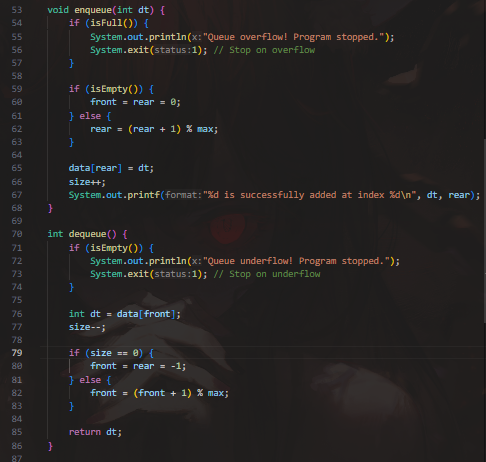
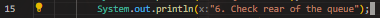
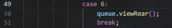
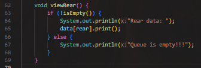
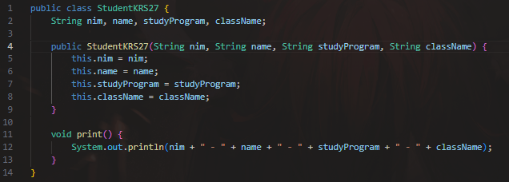
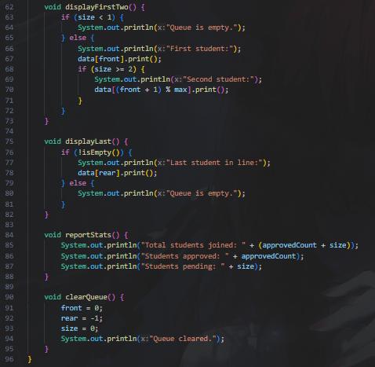
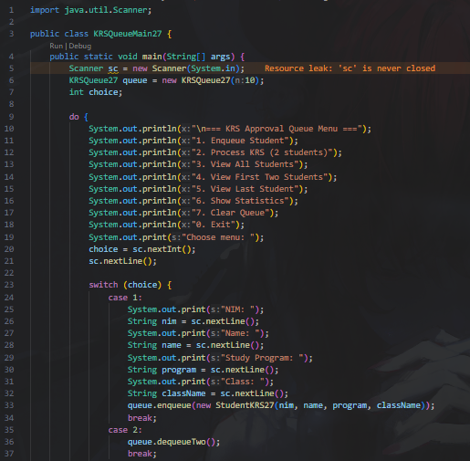
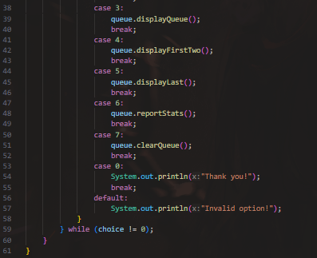

|  | Algorithm and Data Structure |
|--|--|
| NIM |  244107020083|
| Nama |  Zid'Avwa Al Bari'i |
| Kelas | TI - 1I |
| Repository | [link] (https://github.com/ZidAvwa/CollegeStudy/tree/main/2ndSemester) |

# Labs #11 QUEUE

## 11.1 Experiment 1 : Queue Basic Operations

The lab is implemented in Queue27.java, and QueueMain27.java

**Questions:**
1. To indicate the queue is empty initially and no valid indices are used yet.
2. Enables circular queue behavior by wrapping rear back to the start.
3. Wraps front to the beginning when reaching the end, supporting circular traversal.
4. To print from the current front to rear of the circular queue.
5. Moves to the next index in a circular manner using modulo.
6. Code snippet:
    if (isFull()) {
        System.out.println("Queue is full!!!");
        return;
    }
7. Overflow handling (enqueue):
        
        - If the queue is full, it prints "Queue overflow! Program stopped." and calls System.exit(1) to immediately stop the program.

    Underflow handling (dequeue):

        - If the queue is empty, it prints "Queue underflow! Program stopped." and also terminates the program with System.exit(1).

        

## 11.2 Experiment 2 : Academic Service Queue

The lab is implemented in Student27.java, StudentQueue27.java, and StudentQueueMain27.java

**Questions:**
1. Queue (Experiment 1) used primitive or general types (e.g., int), while StudentQueue uses custom objects (Student27). This allows storing multiple related student fields (NIM, name, etc.) in one unit useful for real-world data.
2. In StudentQueue, enqueue inserts a Student27 object and dequeue returns it Compared to primitive-based queues, this supports more complex data per entry.
3. front is set to 0 in StudentQueue to indicate the first valid index from the start. In some earlier queues, -1 means the queue is initially empty and gets adjusted on first insert. This design avoids extra condition checks during peek or dequeue.
4. StudentQueueMain27.java Modification:

    

    

    StudentQueue27.java

    

## 11.3. Assignment

The Assignment is implemented in StudentKRS27.java, KRSQueue27.java, and KRSQueueMain27.java.

**StudentKRS27.java :**

**KRSQueue27.java :**

**KRSQueueMain27.java :**

