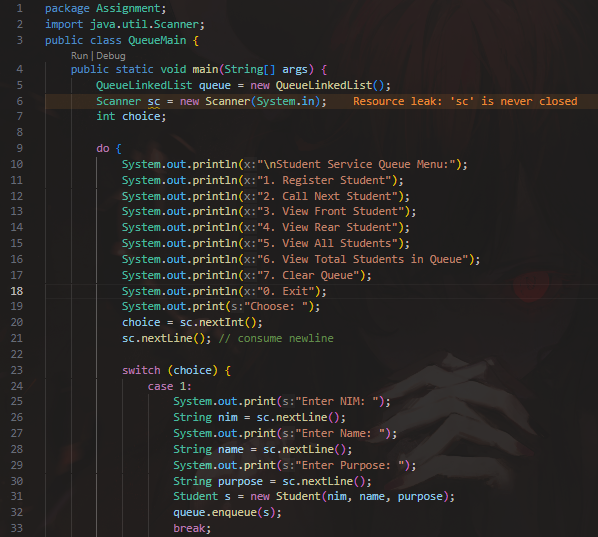
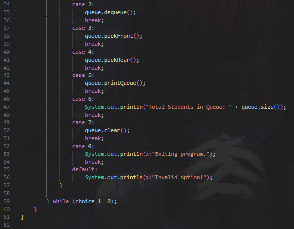

|  | Algorithm and Data Structure |
|--|--|
| NIM |  244107020083|
| Nama |  Zid'Avwa Al Bari'i |
| Kelas | TI - 1I |
| Repository | [link] (https://github.com/ZidAvwa/CollegeStudy/tree/main/2ndSemester) |

# Labs #12 Linked List

## 12.1 Experiment 1 : Queue Basic Operations

The lab is implemented in SingleLinkedList.java, Student27.java, Node.java, and MainLinkedList27.java

**Questions:**
1. Because the list is initially empty and no elements have been added before the first print() call.
2. temp is used to traverse the linked list without modifying the head, allowing access to each node.
3. Use a Scanner object in main() to input student details, create a Student object, and add it to the list.
4. Operations like addLast() would require traversing the entire list to find the last node, making the operation less efficient (O(n) instead of O(1)).

## 12.2 Experiment 2 : Academic Service Queue

The lab is implemented in SingleLinkedList.java, Student27.java, Node.java, and MainLinkedList27.java

**Questions:**
1. To stop traversal once the target node is found and removed, preventing unnecessary checks and potential errors.
2. It removes the node after temp by skipping it and updates tail if the removed node was the last in the list.

## 12.3. Assignment

The Assignment is implemented in Assignment folder Student.java, Node.java, QueueLinkedList.java, and QueueMain.java

**Student.java :**

**Node.java :**

**QueueLinkedList.java :**

**QueueMain.java :**

